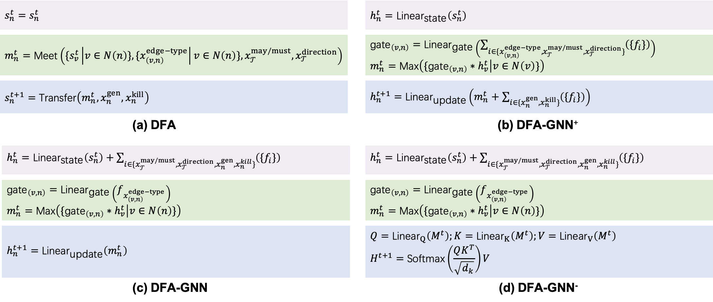

# DFA-GNNs

### Overview

GNN models aligned with the Data-flow analysis (DFA) algorithm. 

Please note that this project is developed based on [The CLRS Algorithmic Reasoning Benchmark](https://github.com/google-deepmind/clrs) . Therefore their original code is also kept. All the code for our experiments is under the `clrs/_src/dfa` directory. Please check `clrs/_src/dfa/dfa_processors.py` for the specific implementations of DFA-GNN+, DFA-GNN, and DFA-GNN-.

### Datasets Accessibility

This paper employs the public dataset from [ProGraML Dataset](https://github.com/ChrisCummins/ProGraML/blob/development/Documentation/DataflowDataset.md) for evaluations. Please note that only [Control-flow graphs (CFGs) they provided](https://zenodo.org/record/4247595/files/graphs_20.06.01.tar.bz2?download=1) are used --- ground-truth labels (and execution trajectories) should be generated from a [edited version of ProGraML](https://anonymous.4open.science/r/programl_edited-DBDB/README.md) project. Therefore this [edited version of ProGraML](https://anonymous.4open.science/r/programl_edited-DBDB/README.md) should be installed as a prerequisite. 

### Dataset Division

All the models are trained on small samples and validated/tested on larger ones (measured by statement count). Therefore the disjointness of train/validation/test sets is achieved by controling the maximum and minimum statement count of the samples in the training/testing setting files (`max_num_pp` and `min_num_pp`).

### Training Settings

This section lists all the setting file used for training. We organize these files by experiments after a brief introduction to their usage. 

#### Usage

Set up the missing fields of each file (e.g., `demo_train_args.json`), and run `python dfa_train.py --params_savedir *** --params demo_train_args.json`.

#### Experiment I

Train models under two modes (with or without trajectory supervision).

All the training setting files of this experiment are under directory `assets/training_settings/experiment_1/`

- **w/o trajectory supervision**
  - DFA-GNN+
    -   `without_trajectory/plus_wo.json`
  - DFA-GNN
    - `without_trajectory/gnn_wo.json`
  - DFA-GNN-
    - `without_trajectory/minus_wo.json`
- **with trajectory supervision**
  - DFA-GNN+
    -   `with_trajectory/plus_w.json`
  - DFA-GNN
    - `with_trajectory/gnn_w.json`
  - DFA-GNN-
    - `with_trajectory/minus_w.json`

#### Experiment II

Train models with various trajectory-length (50, 10, 5, 1).

All the training setting files of this experiment are under directory `assets/training_settings/experiment_2/`

- `trajectory_len = 50`
  - DFA-GNN+
    -   `trace_len_50/plus_50.json`
  - DFA-GNN
    - `trace_len_50/gnn_50.json`
  - DFA-GNN-
    - `trace_len_50/minus_50.json`
- `trajectory_len = 10`
  - DFA-GNN+
    -   training arguments: `trace_len_10/plus_10.json`
  - DFA-GNN
    - training arguments: `trace_len_10/gnn_10.json`
  - DFA-GNN-
    - training arguments: `trace_len_10/minus_10.json`
- `trajectory_len = 5`
  - DFA-GNN+
    -   training arguments: `trace_len_5/plus_5.json`
  - DFA-GNN
    - training arguments: `trace_len_5/gnn_5.json`
  - DFA-GNN-
    - training arguments: `trace_len_5/minus_5.json`
- `trajectory_len = 1`
  - DFA-GNN+
    -   training arguments: `trace_len_1/plus_1.json`
  - DFA-GNN
    - training arguments: `trace_len_1/gnn_1_full.json`
  - DFA-GNN-
    - training arguments: `trace_len_1/minus_1_full.json`

#### Experiment III

Train models with various numbers of samples (1, 10, 100, 1000, full)

All settings of this experiment are under directory `assets/training_settings/experiment_3/`

To generate means and standard deviations of the model performances, each training set with 1, 10, 100, or 1000 samples has 3 different versions, corresponding to `v1`, `v2`, and `v3` settings. For the full training set, we change the random seeds instead.

- `train_set_size = 1`
  - DFA-GNN+
    -   training arguments: `train_set_size_1/plus_1_v1.json`, `train_set_size_1/plus_1_v2.json`, `train_set_size_1/plus_1_v3.json`
  - DFA-GNN
    - training arguments: `train_set_size_1/gnn_1_v1.json`, `train_set_size_1/gnn_1_v2.json`, `train_set_size_1/gnn_1_v3.json`
  - DFA-GNN-
    - training arguments: `train_set_size_1/minus_1_v1.json`, `train_set_size_1/minus_1_v2.json`, `train_set_size_1/minus_1_v3.json`
- `train_set_size = 10`
  - DFA-GNN+
    -   training arguments: `train_set_size_10/plus_10_v1.json`, `train_set_size_10/plus_10_v2.json`, `train_set_size_10/plus_10_v3.json`
  - DFA-GNN
    - training arguments: `train_set_size_10/gnn_10_v1.json`, `train_set_size_10/gnn_10_v2.json`, `train_set_size_10/gnn_10_v3.json`
  - DFA-GNN-
    - training arguments: `train_set_size_10/minus_10_v1.json`, `train_set_size_10/minus_10_v2.json`, `train_set_size_10/minus_10_v3.json`
- `train_set_size = 100`
  - DFA-GNN+
    -   training arguments: `train_set_size_100/plus_100_v1.json`, `train_set_size_100/plus_100_v2.json`, `train_set_size_100/plus_100_v3.json` 
  - DFA-GNN
    - training arguments: `train_set_size_100/gnn_100_v1.json`, `train_set_size_100/gnn_100_v2.json`, `train_set_size_100/gnn_100_v3.json`
  - DFA-GNN-
    - training arguments: `train_set_size_100/minus_100_v1.json`, `train_set_size_100/minus_100_v2.json`, `train_set_size_100/minus_100_v3.json`
- `train_set_size = 1000`
  - DFA-GNN+
    -   training arguments: `train_set_size_1000/plus_1000_v1.json`, `train_set_size_1000/plus_1000_v2.json`, `train_set_size_1000/plus_1000_v3.json`
  - DFA-GNN
    - training arguments: `train_set_size_1000/gnn_1000_v1.json`, `train_set_size_1000/gnn_1000_v2.json`, `train_set_size_1000/gnn_1000_v3.json`
  - DFA-GNN-
    - training arguments: `train_set_size_1000/minus_1000_v1.json`, `train_set_size_1000/minus_1000_v2.json`, `train_set_size_1000/minus_1000_v3.json`
- `train_set_size = 'full'`
  - DFA-GNN+
    -   training arguments: `train_set_size_full/plus_full_v1.json`, `train_set_size_full/plus_full_v2.json`, `etrain_set_size_full/plus_full_v3.json`
  - DFA-GNN
    - training arguments: `train_set_size_full/gnn_full_v1.json`, `train_set_size_full/gnn_full_v2.json`, `train_set_size_full/gnn_full_v3.json`
  - DFA-GNN-
    - training arguments: `train_set_size_full/minus_full_v1.json`, `train_set_size_full/minus_full_v2.json`, `train_set_size_full/minus_full_v3.json`

#### Experiment IV

Train models on various projects (POJ104, GitHub, Linux, TensorFlow)

All settings of this experiment are under directory `assets/training_settings/experiment_4/`

- POJ104
  - DFA-GNN+
    - `poj104/plus_poj104.json`
  - DFA-GNN
    - `poj104/gnn_poj104.json`
  - DFA-GNN-
    - `poj104/minus_poj104.json`
- GitHub
  - DFA-GNN+
    - `github/plus_github.json`
  - DFA-GNN
    - `github/gnn_github.json`
  - DFA-GNN-
    - `github/minus_github.json`
- Linux
  - DFA-GNN+
    - `linux/plus_linux.json`
  - DFA-GNN
    - `linux/gnn_linux.json`
  - DFA-GNN-
    - `linux/minus_linux.json`
- TensorFlow
  - DFA-GNN+
    - `tensorflow/plus_tensorflow.json`
  - DFA-GNN
    - `tensorflow/gnn_tensorflow.json`
  - DFA-GNN-
    - `tensorflow/minus_tensorflow.json`

### Testing Settings

This section lists **some demo** setting files used for testing. We organize these files by testing projects after a brief introduction to their usage. All settings of this experiment are under directory `assets/test_settings_demo/`

#### Usage

After an execution of a specific training process, the training setting file will be renamed according to its 64-bit hash value. After setting this hash value into the `train_params_id` filed of a demo testing setting and run `python dfa_vali_or_test.py --params_savedir *** --params demo_test_args.json --ckpt_idx *`.

Then the model trained under the corresponding training setting will be tested on the specified project.

#### Demo Test Setting Files

- Test on POJ-104
  - POJ-104/500/600: `test_on_poj104_500_600.json`
  - POJ-104/600/700: `test_on_poj104_600_700.json`
  - POJ-104/700/800: `test_on_poj104_700_800.json`
  - POJ-104/800/900: `test_on_poj104_800_900.json`
  - POJ-104/900/1000: `test_on_poj104_900_1000.json`
- Test on GitHub
  - GitHub/500/600: `test_on_github_500_600.json`
- Test on Linux
  - Linux/500/600: `test_on_linux_500_600.json`
- Test on TensorFlow
  - TensorFlow/500/600: `test_on_tf_500_600.json`

### Other Required Files

- **Dataset Information**. Recording mainly the statement count of each sample. Required for filtering samples based on statement counts. Stored under `assets/required_files/Datasets/Statistics/`
  - `poj104_Statistics/poj104_full_statistics.json`,  `github_Statistics/github_full_statistics.json`,  `linux_Statistics/linux_full_statistics.json`,  and `tensorflow_Statistics/tensorflow_full_statistics.json`,  
- **Errored Samples**. Recording the errored samples. Required for avoiding processing the errored samples over and over again. Stored under `assets/required_files/Datasets/Statistics/Logs/ErrorLogs/`
  - `poj104_errors_max500.txt`, `github_errors_max500.txt`, `linux_errors_max500.txt`, and `tensorflow_errors_max500.txt`,

